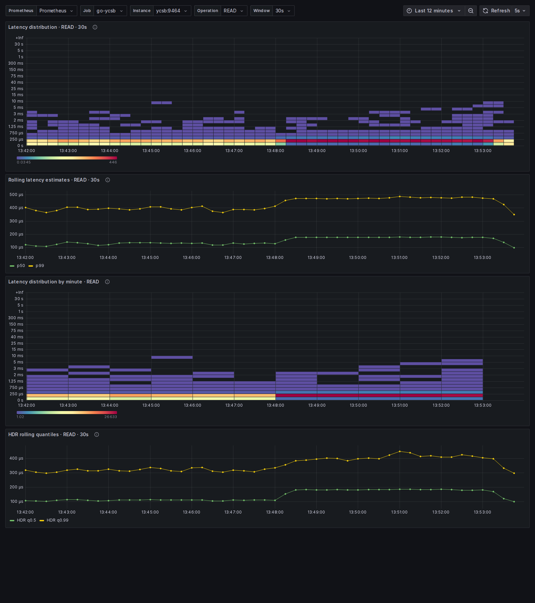

# Live latency heatmap demo

This disposable stack runs go-ycsb against a local Redis container, scrapes
the exporter every second with Prometheus, and provisions the repository's
Grafana dashboard. Its traffic is illustrative; it is not a performance result.

From the repository root:

You need a running Docker Engine and Docker Compose v2 (`docker compose`).
Allow enough local resources to compile the Go binary and run the local stack.

```sh
YCSB_DEMO_VERSION="$(git describe --always --dirty)" docker compose -f demo/compose.yaml up --build -d
```

Open the [load heatmap](http://127.0.0.1:3000/d/ycsb-latency-heatmap/ycsb-live-latency-distribution?var-DS_PROMETHEUS=demo-prometheus&var-job=go-ycsb-load&var-instance=load%3A9464&var-op=INSERT&var-window=30s&from=now-1h&to=now) while the load is running. After it finishes, open the [benchmark heatmap](http://127.0.0.1:3000/d/ycsb-latency-heatmap/ycsb-live-latency-distribution?var-DS_PROMETHEUS=demo-prometheus&var-job=go-ycsb-run&var-instance=ycsb%3A9464&var-op=READ&var-window=30s&from=now-12m&to=now). The load link uses a one-hour range so its data remains visible during the 30-minute benchmark; zoom into the load interval to inspect it.
The load targets 100 inserts/s for 72,000 records (about 12 minutes); let the
`ycsb` container run for at least 12 minutes to fill the benchmark timeline.
The heatmap needs two scrapes before it has data; the rolling 30s and 60s HDR
gauges need 30 and 60 completed reporter slices. While each stage runs, its
exporter serves `/metrics` and the latest full HDR buckets at `/hdr-windows`:
the load at <http://127.0.0.1:9465/metrics> and the benchmark at
<http://127.0.0.1:9464/metrics>. Prometheus is at <http://127.0.0.1:9090>.

The first `load` container inserts 72,000 disposable records, then the `ycsb`
container runs Workload A (50% reads, 50% updates) at a target of 1,000 ops/s
for up to 1.8 million operations (about 30 minutes). Redis and the YCSB exporter have no
host exposure beyond the loopback exporter ports. Grafana and Prometheus also
bind only to loopback. To stop the traffic and remove the sample data:

```sh
docker compose -f demo/compose.yaml down -v
```

The dashboard's minute heatmap uses the exporter's fixed Prometheus buckets.
Its cells estimate counts over trailing 60-second intervals; they are not
aligned to wall-clock minute boundaries, and Grafana may combine intervals when
you zoom out.
The full packed HDR bucket arrays are available live at `/hdr-windows`; historical
full-HDR minute snapshots from both phases are saved separately in
`demo/captures/load-hdr-minutes.jsonl` and `demo/captures/run-hdr-minutes.jsonl`.
The directory is ignored by Git and survives `docker compose down -v`; delete
it when you no longer need the captures. Grafana's included heatmaps use the
fixed Prometheus buckets. Viewing the full-HDR historical minute snapshots as
a Grafana heatmap still needs a data-source ingestion step.

## Sample capture



This screenshot is an illustrative local run, not a Redis or go-ycsb performance
claim. It shows READ operations, the fixed-bucket trailing-minute heatmap, and
the packed HDR quantile panel. The sample was captured with a twelve-minute
dashboard range. This older run-only capture predates the load exporter and
used 10,000 keys; it is not a capture of the two-stage configuration above.

| Capture detail | Value |
| --- | --- |
| Capture time | 2026-10-07 13:54:04 UTC |
| Local run ID | YCSB container `8c1fc2983b21` (started 2026-10-07 13:38:51 UTC) |
| go-ycsb source/build | Commit `926e385`, as exported by `ycsb_info` |
| Data node | One local Redis 8.10.2 container on an arm64 Colima VM; 10,000 keys |
| Neptune operator build | N/A; no Neptune cluster was used |
| Errors | 0 READ and 0 UPDATE run-phase errors; separate load container exited 0 |
| Profiled | No |
